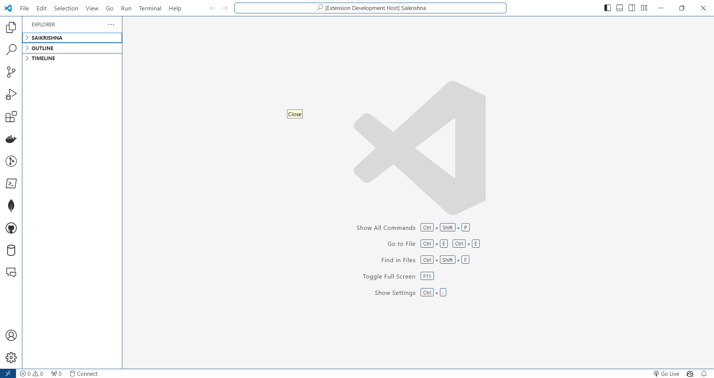

# Prism Pulse - Visual Studio Code Theme

## Overview

Immerse yourself in the vibrant energy of coding with Prism Pulse, a dynamic Visual Studio Code theme that pulsates with a spectrum of colors. Whether you're navigating intricate code structures or crafting elegant algorithms, Prism Pulse enhances your coding experience with a harmonious blend of vivid hues. Embrace the rhythm of productivity as your code comes to life in a visually captivating dance of light. Let Prism Pulse illuminate your coding journey with its sleek design and energetic vibe, making every line of code a mesmerizing part of your development symphony.

## Features

- **Dynamic Color Palette:** A carefully curated color scheme for an engaging coding experience.
- **Sleek Design:** A modern and visually appealing design that enhances code readability.
- **Versatile:** Suitable for various programming languages and file types.

## Installation

1. Launch Visual Studio Code.
2. Go to the Extensions view (`Ctrl+Shift+X` or `Cmd+Shift+X` on macOS).
3. Search for "Prism Pulse" and click install.

## Usage

1. Open Visual Studio Code.
2. Go to File > Preferences > Color Theme.
3. Select "Prism Pulse" from the list.

## Screenshots

## Contributing

If you find any issues or have suggestions for improvements, feel free to [open an issue](https://github.com/YourGitHubUsername/Prism-Pulse/issues) or [create a pull request](https://github.com/YourGitHubUsername/Prism-Pulse/pulls).

## License

This project is licensed under the [MIT License](https://github.com/srivarshithdaladuli/Prism-Pulse/blob/master/LICENSE).

---

**Enjoy coding with Prism Pulse! 🚀**

For more information, visit the [GitHub repository](https://github.com/YourGitHubUsername/Prism-Pulse).

